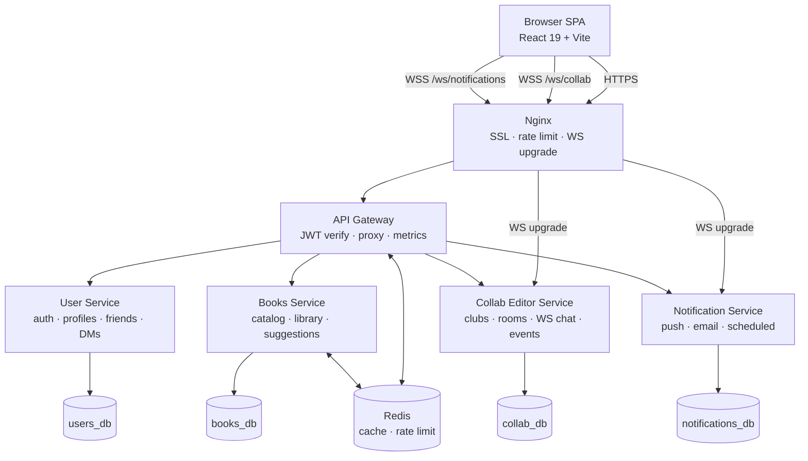
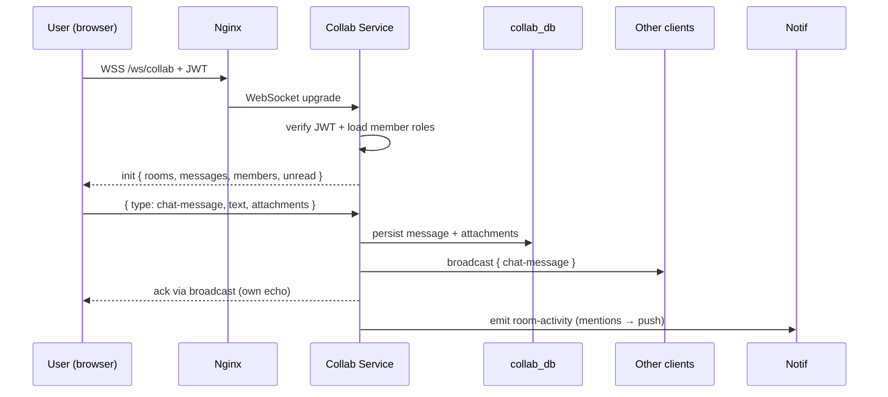

<div align="center">

# 📚 MyBookClubs

### A full-stack, real-time book club platform built with microservices

*Create clubs, discuss books in real-time, track your reading, and connect with fellow readers.*

[](https://nodejs.org/)
[](https://react.dev/)
[](https://www.typescriptlang.org/)
[](https://www.postgresql.org/)
[](https://www.docker.com/)
[](https://redis.io/)
[](https://prometheus.io/)
[](https://grafana.com/)

</div>

> **Live demo:** _add staging URL here_ · **Demo account:** _email / password_

---

## Overview

**MyBookClubs** is a Discord-inspired community platform purpose-built for reading groups. Users can create and join book clubs with real-time chat, organize reading schedules, vote on book suggestions, track progress, and receive push notifications — all within a responsive single-page application backed by a resilient microservices architecture.

The project demonstrates production-grade engineering practices including service isolation, API gateway routing, WebSocket real-time communication, JWT-based authentication with refresh tokens, observability with Prometheus/Grafana/Loki, and containerized deployment with Docker.

### Highlights

- **5-service microservices backend** with strict per-service database ownership and gateway-only public surface.
- **Real-time chat over WebSockets** with reactions, replies, edits, mentions, presence and typing indicators.
- **Real-time push notification stream** with scheduled email reminders and per-type user preferences.
- **Production-ready ops**: Nginx reverse proxy, Redis-backed distributed rate limiting, Prometheus metrics, Grafana dashboards, Loki log aggregation, alert rules.
- **Modern frontend stack**: React 19 + the React Compiler, Vite 7, Tailwind 4, MSW for API mocking, Vitest + Testing Library.

---

## Screenshots

> _Add screenshots / GIFs here: club chat, calendar, suggestions voting, Grafana dashboards._

---

## Architecture



<details>
<summary>ASCII version</summary>

```
┌────────────────────────────────────────────────────────────────────┐
│                          Nginx Reverse Proxy                       │
│            Rate Limiting · WebSocket Upgrade · SSL/TLS             │
└────────┬──────────────┬──────────────────┬────────────────────┬────┘
         │              │                  │                    │
    HTTP /v1/      WS /ws/collab    WS /ws/notifications    Static /
         │              │                  │                    │
         ▼              │                  │                    ▼
┌─────────────────┐     │                  │          ┌──────────────┐
│   API Gateway   │     │                  │          │   Frontend   │
│   (Express 5)   │     │                  │          │  (React 19)  │
│                 │     │                  │          │   Vite SPA   │
│ • Auth verify   │     │                  │          └──────────────┘
│ • Rate limiting │     │                  │
│ • Proxy routing │     │                  │
│ • Metrics       │     │                  │
└──┬───┬───┬───┬──┘     │                  │
   │   │   │   │        │                  │
   ▼   ▼   ▼   ▼        ▼                  ▼
┌──────┐ ┌──────────┐ ┌──────────────┐ ┌──────────────────┐
│User  │ │  Books   │ │Collab Editor │ │  Notification    │
│Svc   │ │  Svc     │ │  (Clubs)     │ │  Service         │
│      │ │          │ │              │ │                  │
│:3001 │ │  :3002   │ │   :4000      │ │     :3005        │
└──┬───┘ └───┬──────┘ └──────┬───────┘ └────────┬─────────┘
   │         │               │                   │
   ▼         ▼               ▼                   ▼
┌──────┐ ┌──────┐      ┌──────────┐        ┌──────────┐
│Users │ │Books │      │ Collab   │        │  Notif   │
│ DB   │ │ DB   │      │   DB     │        │   DB     │
└──────┘ └──────┘      └──────────┘        └──────────┘
  PostgreSQL 16          PostgreSQL 16        PostgreSQL 16
                  ┌──────────┐
                  │  Redis   │
                  │ Cache +  │
                  │Rate Limit│
                  └──────────┘
```

</details>

Each microservice owns its database and communicates only through the API Gateway — enforcing strict service boundaries and independent scalability.

| Service | Port | Responsibility |
|---|---|---|
| **API Gateway** | 3000 | Request routing, JWT verification, rate limiting, health checks, Prometheus metrics |
| **User Service** | 3001 | Authentication (local + Google OAuth), profiles, friendships, direct messaging |
| **Collab Editor** | 4000 | Book clubs, rooms/channels, real-time WebSocket chat, events, meetings, invites |
| **Books Service** | 3002 | Book catalog (Google Books API), libraries, reading progress, suggestions, reviews |
| **Notification Service** | 3005 | Real-time push notifications, scheduled reminders, email delivery |

---

## Features

### Authentication & User Management
- **Dual authentication** — local email/password registration with JWT access + refresh tokens, and Google OAuth 2.0 sign-in
- **Email verification** — token-based email verification flow with resend capability
- **Password management** — forgot password / reset via email, change password (with OAuth detection)
- **User profiles** — bio, profile image upload, online status (Online, Away, Busy, Offline)

### Book Clubs
- **Club management** — create, discover, and join book clubs with configurable visibility (Public, Private, Invite-Only)
- **Role-based access control** — Owner, Admin, Moderator, and Member roles with granular permissions
- **Membership workflows** — join requests for private clubs with admin approval panel
- **Invite system** — shareable invite links with optional expiration and usage limits
- **Category-based discovery** — filter and explore clubs by category

### Real-Time Chat
- **WebSocket-powered messaging** — instant message delivery across multiple rooms/channels per club
- **Rich message features** — replies, editing, deletion, pinning, emoji reactions, @mention autocomplete
- **File attachments** — image uploads within chat
- **Emoji picker** integration
- **Unread indicators** — per-room unread tracking with section-level activity markers
- **Connected users sidebar** with live presence
- **Rate limiting** — 15 messages per 5 seconds per client

### Direct Messaging
- Private conversations between users with reactions, replies, editing, and attachments

### Books & Reading
- **Book search** — powered by the Google Books API with Redis caching
- **Personal library** — categorize books as favorites, currently reading, want to read, or completed
- **Club books** — assign current, upcoming, and completed books to clubs
- **Reading progress** — track pages read with optional notes
- **Suggestions & voting** — members suggest books with upvote/downvote system
- **Ratings & reviews** — 5-star ratings and written reviews per club book

### Calendar & Meetings
- **Event scheduling** — book club calendar with events and meetings
- **Meeting links** — integration with Zoom, Google Meet, Teams, and Discord
- **RSVP system** — Attending, Maybe, Not Attending with real-time status tracking
- **Meeting lifecycle** — Scheduled → Live → Ended / Cancelled

### Notifications
- **Real-time push** — WebSocket-delivered notifications for club activity
- **Scheduled reminders** — automatic 24h, 1h, and start-time reminders for meetings
- **Email notifications** — SMTP-powered email delivery with logging
- **User preferences** — per-type toggle for push and email notifications

---

## Tech Stack

### Frontend
| Technology | Purpose |
|---|---|
| React 19 | UI framework |
| React Router v6 | Client-side routing |
| Vite 7 | Build tooling & dev server |
| Tailwind CSS 4 | Utility-first styling |
| WebSocket (native) | Real-time chat & notifications |
| Monaco Editor | Rich text editing |
| Google OAuth | Social sign-in |
| Axios | HTTP client |
| Emoji Mart | Emoji picker |

### Backend
| Technology | Purpose |
|---|---|
| Node.js 20 | Runtime |
| Express 4/5 | HTTP framework |
| TypeScript 5 | Type safety |
| Prisma ORM | Database access & migrations |
| WebSocket (ws) | Real-time communication |
| JWT + Refresh Tokens | Authentication |
| Passport.js | Google OAuth strategy |
| Joi / Zod | Request validation |
| Multer | File uploads |
| Winston | Structured logging |
| prom-client | Prometheus metrics |
| Nodemailer | Email delivery |
| bcrypt | Password hashing |

### Infrastructure
| Technology | Purpose |
|---|---|
| Docker + Compose | Containerization & orchestration |
| Nginx 1.27 | Reverse proxy, rate limiting, SSL termination |
| PostgreSQL 16 | Primary database (one per service) |
| Redis | Caching & distributed rate limiting |
| Prometheus | Metrics collection |
| Grafana | Dashboards & visualization |
| Loki + Promtail | Log aggregation |

---

## Database Schema

Each service manages its own PostgreSQL database with Prisma ORM:

```
users_db                collab_db                books_db              notifications_db
├── User                ├── BookClub             ├── Book              ├── Notification
├── RefreshToken        ├── BookClubMember       ├── BookClubBook      ├── ScheduledNotification
├── Friendship          ├── MembershipRequest    ├── UserBook          ├── NotificationPreference
├── DirectMessage       ├── Room                 ├── ReadingProgress   └── EmailLog
└── DMReaction          ├── RoomMember           ├── BookSuggestion
                        ├── Message              ├── BookSuggestionVote
                        ├── Reaction             ├── BookClubBookRating
                        ├── ChatFile             └── BookClubBookReview
                        ├── BookClubEvent
                        ├── Meeting
                        ├── MeetingRSVP
                        ├── BookClubInvite
                        ├── RoomRead
                        ├── SectionRead
                        └── SectionActivity
```

---

## Getting Started

### Prerequisites

- [Docker](https://www.docker.com/get-started) and Docker Compose
- [Node.js 20+](https://nodejs.org/) (for local development without Docker)
- A [Google OAuth](https://console.cloud.google.com/) client ID/secret (for social sign-in)
- A [Google Books API](https://developers.google.com/books) key

### Environment Setup

Create a `.env` file in the project root:

```env
# JWT
JWT_SECRET=your_jwt_secret
JWT_REFRESH_SECRET=your_refresh_secret

# Database
POSTGRES_USER=postgres
POSTGRES_PASSWORD=your_db_password

# Google OAuth
GOOGLE_CLIENT_ID=your_google_client_id
GOOGLE_CLIENT_SECRET=your_google_client_secret

# Google Books API
GOOGLE_BOOKS_API_KEY=your_api_key

# SMTP (email notifications)
SMTP_HOST=smtp.gmail.com
SMTP_PORT=587
SMTP_USER=your_email@gmail.com
SMTP_PASS=your_app_password

# Redis
REDIS_PASSWORD=your_redis_password

# Frontend
VITE_API_URL=http://localhost
VITE_WS_URL=ws://localhost

# Grafana
GF_SECURITY_ADMIN_PASSWORD=your_grafana_password
```

### Running with Docker

```bash
# Development (with hot-reload)
docker compose up --build

# Production
docker compose -f docker-compose.prod.yml up --build -d
```

The application will be available at:

| Service | URL |
|---|---|
| Application | http://localhost |
| API Gateway | http://localhost/v1 |
| Grafana | http://localhost:3100 |
| Prometheus | http://localhost:9090 |

### Running Locally (without Docker)

```bash
# Install dependencies for each service
cd backend/gateway && npm install
cd ../user-service && npm install
cd ../collab-editor && npm install
cd ../books-service && npm install
cd ../notification-service && npm install
cd ../../frontend && npm install

# Run Prisma migrations (for each service with a database)
cd backend/user-service && npx prisma migrate dev
cd ../collab-editor && npx prisma migrate dev
cd ../books-service && npx prisma migrate dev
cd ../notification-service && npx prisma migrate dev

# Start each service (in separate terminals)
cd backend/gateway && npm run dev
cd backend/user-service && npm run dev
cd backend/collab-editor && npm run dev
cd backend/books-service && npm run dev
cd backend/notification-service && npm run dev
cd frontend && npm run dev
```

---

## Testing

Each backend service includes unit and integration tests using Jest and Supertest:

```bash
# Run all tests for a service
cd backend/<service-name> && npm test

# Run with coverage
npm run test:coverage

# Run only unit tests
npm run test:unit

# Run only integration tests
npm run test:integration

# Watch mode
npm run test:watch
```

---

## Monitoring & Observability

The production stack includes a full observability suite:

- **Prometheus** scrapes metrics from all 5 services every 15 seconds
- **Grafana** comes pre-provisioned with Prometheus and Loki data sources and ready-to-use dashboards
- **Loki + Promtail** aggregates container logs from all Docker services
- **Alert rules** monitor for service downtime, high error rates, slow responses, memory usage spikes, event loop lag, and elevated auth failure rates

---

## Production Readiness

| Concern | Implementation |
|---|---|
| **Security** | Helmet headers, XSS sanitization, bcrypt hashing, rate limiting (Nginx + Redis), CORS, input validation |
| **Authentication** | JWT with short-lived access tokens + refresh token rotation, Google OAuth 2.0 |
| **Containerization** | Multi-stage Docker builds, non-root users, Alpine images, production `npm ci --omit=dev` |
| **Networking** | Internal Docker network, only Nginx exposed, WebSocket upgrade handling |
| **SSL/TLS** | Nginx configured for TLSv1.2/1.3 (certificate paths ready) |
| **Monitoring** | Prometheus metrics, Grafana dashboards, Loki log aggregation, alert rules |
| **Logging** | Winston structured JSON logging with Loki integration |
| **Data** | Prisma ORM with migrations, 4 isolated PostgreSQL databases, Redis caching |
| **Uploads** | Persistent Docker volumes for user and club media |

---

## Project Structure

```
bookclubs/
├── frontend/                  # React 19 SPA (Vite + Tailwind)
│   ├── src/
│   │   ├── api/               # API client modules
│   │   ├── components/        # Reusable UI components
│   │   ├── context/           # React context providers
│   │   ├── hooks/             # Custom hooks
│   │   ├── pages/             # Route page components
│   │   └── utils/             # Utility functions
│   └── public/
├── backend/
│   ├── gateway/               # API Gateway (Express 5)
│   ├── user-service/          # Auth & user management
│   ├── collab-editor/         # Book clubs & real-time chat
│   ├── books-service/         # Books, progress & suggestions
│   └── notification-service/  # Push, email & scheduled notifications
├── nginx/                     # Reverse proxy configuration
├── monitoring/                # Prometheus, Grafana, Loki, alerts
├── docs/                      # Additional documentation
├── docker-compose.yml         # Development environment
└── docker-compose.prod.yml    # Production environment
```

---

## API Routes

All API routes are proxied through the Gateway at `/v1/`:

| Prefix | Service | Auth |
|---|---|---|
| `/v1/auth` | User Service | Public |
| `/v1/profile` | User Service | Optional |
| `/v1/users` | User Service | Required |
| `/v1/friends` | User Service | Required |
| `/v1/messages` | User Service | Required |
| `/v1/bookclubs` | Collab Editor | Required |
| `/v1/invites` | Collab Editor | Required |
| `/v1/books` | Books Service | Public |
| `/v1/user-books` | Books Service | Required |
| `/v1/bookclub-books` | Books Service | Required |
| `/v1/notifications` | Notification Service | Required |
| `/ws/collab` | Collab Editor | WebSocket |
| `/ws/notifications` | Notification Service | WebSocket |

---

## Real-Time Chat Flow



The `init` payload bundles room metadata, the most-recent messages, members, presence and unread cursors in a single round-trip — keeping cold-load to one network event. Subsequent state mutations (reactions, edits, deletes) are funnelled through a pure reducer on the client so message ordering and identity stay consistent regardless of arrival order.

---

## Engineering Decisions & Trade-offs

This section documents the choices behind the design — and the things I'd tackle next given more time.

### Why microservices for a portfolio project?
A monolith would have shipped faster, but the goal was to demonstrate boundary design — service-owned databases, gateway-mediated traffic, isolated deploys. The cost is operational complexity (more containers, more migrations, more env wiring) and the absence of cross-service transactions; I deliberately accepted eventual consistency between bookclub-side membership and books-side bookclub-book records.

### Database per service
Each service owns its PostgreSQL schema and is the only writer. There are no foreign keys across service boundaries — instead, entities reference the user's `id` from `users_db` by UUID. This keeps services independently deployable and migratable, at the cost of having to denormalise the user's display name and avatar where they're shown in chat.

### Why WebSockets directly instead of Socket.IO?
The native `ws` API on the server and the browser-native `WebSocket` on the client are smaller, dependency-free, and force a clean message protocol. Socket.IO's automatic fallbacks are unnecessary for an authenticated, modern-browser app. The trade-off is that I had to implement reconnection-with-backoff and message reducers myself.

### Auth: short-lived access + rotating refresh
Access tokens are short-lived (15 min) and refresh tokens rotate on every use, with the previous token invalidated server-side — limiting the blast radius of a stolen token. See [docs/AUTH_HARDENING.md](docs/AUTH_HARDENING.md) for the full threat model and implementation notes.

### Rate limiting via Redis
Per-IP and per-user buckets live in Redis so the gateway scales horizontally without hot-spotting one instance. Nginx provides a coarse outer limit; the gateway enforces fine-grained per-route policies (auth endpoints stricter than reads).

### Observability before features
Prometheus scraping, Grafana dashboards, Loki log aggregation, and alert rules were wired up early — before half the features existed. This forced every service to expose `/metrics` and structure its logs from day one.

### What I'd do differently
- **Split the bookclub page component.** The main page hook tree grew organically and the page file is too large; the view-router branches and modal cluster should be separate components.
- **Replace ad-hoc message-state refs with a state machine.** The WebSocket hook leans on several `useRef` flags to track stale closures and reconnection state; an XState machine or a `useReducer` per concern would make the lifecycle far easier to reason about.
- **Promote shared TypeScript types to a workspace package.** Message and entity shapes are duplicated between frontend and the collab service — a `packages/shared-types` workspace would eliminate drift.
- **Add E2E tests.** The unit/integration coverage is solid per service, but a Playwright smoke suite would catch the kinds of cross-service regressions that unit tests miss.
- **Migrate from Express to Fastify** in the gateway for lower per-request overhead and built-in schema validation.
- **Move file uploads to S3-compatible storage** instead of Docker volumes — the current setup ties uploads to a single host.

---

## License

This project was built as a portfolio demonstration of full-stack development and microservices architecture.

---

<div align="center">

Built with modern web technologies and production-grade engineering practices.

</div>
